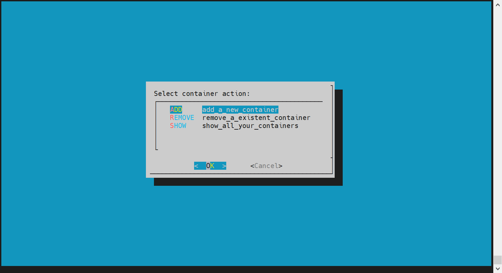
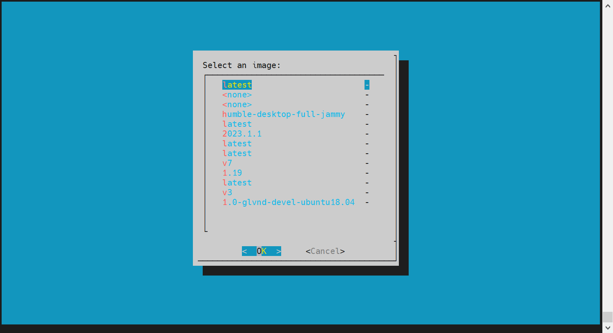

# 1. Introduction

* For a small group or a team, who has not too much number of server or especially GPU server, shares their machine to multiusers. The operation and maintenance of the server is very important. If the admin user gives too much power to the user, some misoperation would cause the machine down. But if not, the admin user should always spent a lot of time to install/remove apps or upload/download files. Whether the admin user could give less attention to the maintenance and the users could still have flexibility to use the machine. This project try to give a solution.

# 2. Description

## 2.1. Tools used

* SSH - to let the user login to the machine and gives them different rights.
* Docker - to let the user operation in isolated system.
* Dialog - to give the user a interactive menu.
* [optional] Anaconda - users could use isolated enviroment in the docker container
* [optional] OSS, Vepfs - to give user an extra storage.

## 2.2. Files

``` bash
.
├── docs
│   ├── menu1.png
│   └── menu2.png
├── README.md
└── scripts
    ├── create_container.sh (the script which used to create the docker container)
    └── ssh_interactive_script.sh (the script which used to give the interactive menu)
```

## 2.3. Dependensies

``` bash
sudo apt install openssh-server dialog docker docker.io
```

# 3. Details

## 3.1. ssh configuration

``` bash
# change the configuraton of ssh
vi /etc/ssh/sshd_config
# At the end of the file, modify by appending a specified user list after User, and you can specify any script or command to execute after ForceCommand.
Match User 
    [local_user_name1,local_user_name2...]
    PasswordAuthentication yes
# The path of the ssh_interactive_script.sh
    ForceCommand /etc/ssh_interactive/ssh_interactive_script.sh
```


## 3.2. The execution of the ssh_interactive_script.sh

* Follow the guide of the menu.

* Main menu


* Add/Remove/Show


* If the Add select, create_container.sh script will be used to create the container

## 3.3. The execution of the create_container.sh

### Parameters:

* `ssh_port`: Used for ssh login.
* `custom_port`: Used for custom usage.
* `user`: the name of the user. Used for data transform from container to host. It will create a folder in /data/datasets/users/ with the name of the username given. `If you want to use other storage, you could mount the storage and create the folder in the volume`. Gives user docker group rights. `sudo usermod -aG docker ${USER}`
* `image tag`: the tag of the docker image. `The namespace of the image should be the same as it is in the create command part`.
* `ai_data`: whether mount a read-only data volume.
* `option`: custom create container options.
